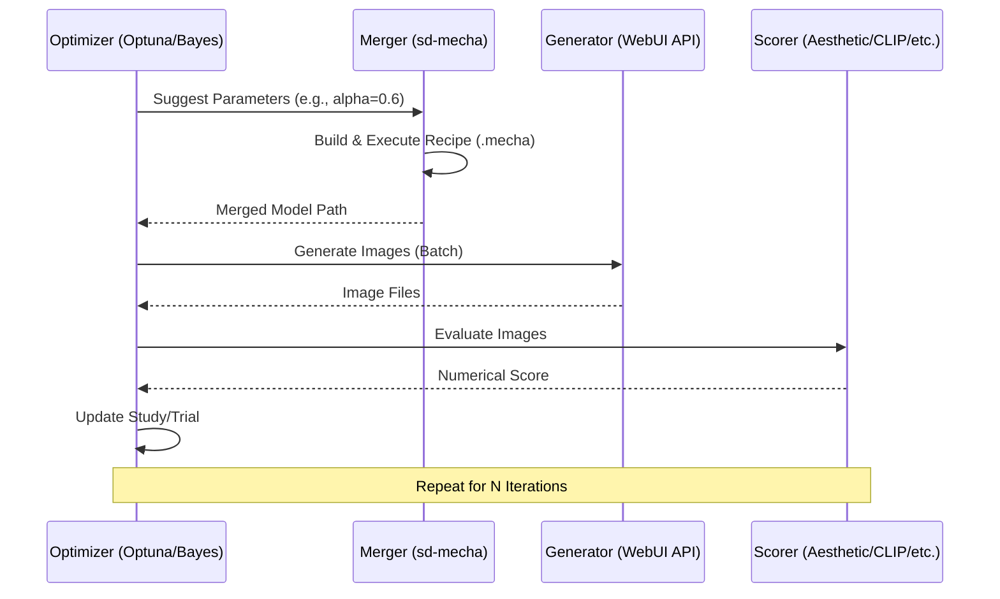

# AGENTS.md - Operating Manual

This document provides the essential technical context, architectural overview, and mandatory protocols for working on the `sd-optim` repository.

## 1. Project Overview

`sd-optim` is an automated framework for optimizing Stable Diffusion model merging. It uses optimization (via Optuna or BayesOpt) to find the best merge parameters (weights, ratios, etc.) by evaluating generated images against a suite of AI-driven and manual scorers.

### Key Technologies

- **Optimization:** [Optuna](file:///d:/stable-diffusion-webui-reForge/extensions/sd-optim/conductor/tech-stack.md#L9) (CMA-ES, TPE, etc.)
- **Merging Backend:** [sd-mecha](file:///d:/stable-diffusion-webui-reForge/extensions/sd-optim/conductor/tech-stack.md#L6) (Graph-based tensor merging)
- **Configuration:** Hydra & OmegaConf
- **WebUI Integration:** A1111/Forge/ComfyUI via custom API adapters.

---

## 2. Architecture & Flow

### High-Level Loop

The optimization process follows a modular loop:

---

## 3. Directory Orientation

| Directory                                                                                                         | Purpose                                                                                                     |
| :---------------------------------------------------------------------------------------------------------------- | :---------------------------------------------------------------------------------------------------------- |
| [`conf/`](file:///d:/stable-diffusion-webui-reForge/extensions/sd-optim/conf)                                     | **The Brain:** Central Hydra configuration. Includes `config.yaml`, `optimization_guide/`, and `payloads/`. |
| [`sd_optim/`](file:///d:/stable-diffusion-webui-reForge/extensions/sd-optim/sd_optim)                             | **The Engine:** Core logic. Includes optimizers, mergers, scorers, and prompters.                           |
| [`sd_optim/model_configs/`](file:///d:/stable-diffusion-webui-reForge/extensions/sd-optim/sd_optim/model_configs) | `sd-mecha` block definitions (SDXL, SD1.5, etc.).                                                           |
| [`scripts/`](file:///d:/stable-diffusion-webui-reForge/extensions/sd-optim/scripts)                               | **The Bridge:** `api.py` provides custom endpoints for A1111/Forge to handle model loading/unloading.       |
| [`conductor/`](file:///d:/stable-diffusion-webui-reForge/extensions/sd-optim/conductor)                           | **The Warden:** Project management, tech-stack definitions, tracks, and the mandatory development workflow. |

---

## 4. Key Component Deep Dives

### [Parameter Handling (`bounds.py`)](file:///d:/stable-diffusion-webui-reForge/extensions/sd-optim/sd_optim/bounds.py)

The `ParameterHandler` translates the `optimization_guide/guide.yaml` into actual search spaces for Optuna. It supports strategies like `all`, `select`, `group`, and `single` to map parameters across different UNET/CLIP blocks.

### [Merge Backend (`merge_methods.py`)](file:///d:/stable-diffusion-webui-reForge/extensions/sd-optim/sd_optim/merge_methods.py)

This massive library contains specialized merging algorithms (Polar Decomposition, SLERP, Wavelets). Methods are registered with `sd-mecha` using the `@merge_method` decorator.

### [Scoring System (`scorer.py`)](file:///d:/stable-diffusion-webui-reForge/extensions/sd-optim/sd_optim/scorer.py)

The `AestheticScorer` manages multiple evaluation models. It supports lazy loading to save VRAM and allows for complex weighted averaging across multiple scorers.

---

## 5. Mandatory Agent Protocols

All agents **MUST** follow the [Project Workflow](file:///d:/stable-diffusion-webui-reForge/extensions/sd-optim/conductor/workflow.md). Failure to do so will result in rejected implementations.

### Red-Green-Refactor (TDD)

1. **Red:** Write a failing test in `tests/` before any implementation.
2. **Green:** Write the minimum code to pass the test.
3. **Refactor:** Clean up while keeping tests green.

### Conductor Tasks

All work must be tracked in a `plan.md` within a track directory (e.g., `conductor/tracks/modernization_p1_.../`).

- Mark tasks as `[~]` (in progress) and `[x]` (complete).
- Attach summaries to commits using `git notes`.

### Coding Standards

- **Type Hints:** Required for all new function/method signatures.
- **Async:** Use `asyncio` and `aiohttp` for all I/O-bound tasks (Generator, Scorer API).
- **Logging:** Use the structured logger (`logger = logging.getLogger(__name__)`).

---

## 6. Common Operations

### Adding a New Scorer

1. Add model metadata to `MODEL_DATA` in `scorer.py`.
2. Implement the scoring logic in `AestheticScorer.score()`.
3. Update `config.yaml` to include the new scorer ID.

### Adding a New Merge Method

1. Define the method in `merge_methods.py` within the `MergeMethods` class.
2. Decorate it with `@merge_method` and use `Parameter` and `Return` type hints.
3. It will be automatically registered when `sd_optim.py` loads custom converters.

---

## 7. Troubleshooting

- **API Connection:** Ensure the target WebUI is running and matches the `url` in `config.yaml`.
- **CUDA OOM:** Enable `scorer_lazy_load_list` or use `scorer_default_device: cpu` for heavy scorers.
- **Config Mismatches:** Run `sd_optim.py` with `hydra.verbose=true` to debug configuration resolution.
