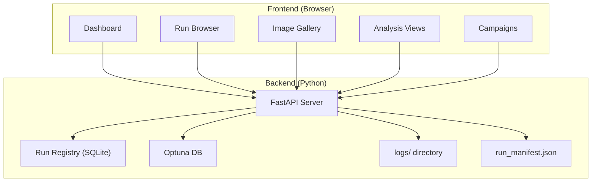

# DX Improvement Plan: UI-First Approach

## Context

You already have strong backend plans in place:

- **Repo Reorg** ([plan.md](file:///d:/stable-diffusion-webui-reForge/extensions/sd-optim/conductor/tracks/repo_reorg_p1_20260210/plan.md)): Clean package boundaries, CLI entry points
- **Image Reuse** ([plan.md](file:///d:/stable-diffusion-webui-reForge/extensions/sd-optim/conductor/tracks/image_reuse_p1_20260210/plan.md)): Deterministic fingerprinting, manifest v2, incremental rescoring
- **Product Guidelines** ([guidelines](file:///d:/stable-diffusion-webui-reForge/extensions/sd-optim/conductor/product-guidelines.md)): "Data-First Design" with high-fidelity visualization

The missing piece is a **UI layer** that makes all this infrastructure accessible without terminal commands.

## The Friction Map

| Pain Point                         | Root Cause                 | What a UI Solves                 |
| ---------------------------------- | -------------------------- | -------------------------------- |
| "Which run had that good result?"  | No cross-run index         | Searchable run list with filters |
| "What params produced this image?" | Buried in JSONL/config     | Click image → see trial params   |
| "How did the optimizer converge?"  | Must run ad-hoc scripts    | Live convergence plots           |
| "Continue from where I left off"   | Manual config editing      | "Fork" button on any run         |
| "Compare two runs"                 | Copy-paste terminal output | Side-by-side diff view           |
| "What's running right now?"        | Watch `sd_optim.log`       | Live progress dashboard          |

## Proposed Architecture

### Tech Stack Addition

- **API**: FastAPI (already have `aiohttp` in deps; FastAPI is a natural fit)
- **Frontend**: Vite + React (or even plain HTML + HTMX for simplicity)
- **Data**: SQLite Run Registry + existing Optuna DBs + manifest JSON files

## Core Views

### 1. Run Browser (P0)

The landing page. A filterable, sortable table of all runs.

| Column     | Source               |
| ---------- | -------------------- |
| Date       | Dir name             |
| Method     | `.hydra/config.yaml` |
| Scorers    | Config               |
| Best Score | `best.log` / JSONL   |
| Trials     | JSONL line count     |
| Tags       | User-assigned        |
| Status     | Running / Complete   |

**Actions**: Open, Compare, Fork, Tag, Delete

### 2. Run Detail (P0)

Click any run to see:

- **Convergence Plot** (Optuna history, already generated as PNG)
- **Best Params** (formatted table)
- **Config Diff** (vs previous run or vs default)
- **Image Grid** (thumbnails sorted by score, click to expand)

### 3. Image Gallery (P1)

- Grid of thumbnails with score overlay
- Click to see full image + all scorer breakdowns
- Filter by score range, scorer, trial number
- Side-by-side comparison mode

### 4. Analysis Dashboard (P2)

- Parameter importance (existing `analyze_importance.py` output)
- Failure trends (existing `failure_trend_analysis.py` output)
- Cross-run parameter evolution chart
- Model forensics viewer (layer deviation heatmap)

### 5. Live Monitor (P2)

- Real-time trial progress (tail the JSONL)
- Current best score + params
- Estimated time remaining
- Kill/pause button

## Dependency on Existing Plans

| UI Feature        | Depends On                                 |
| ----------------- | ------------------------------------------ |
| Run Browser       | Repo Reorg Phase 1 (CLI scaffolding)       |
| Image Gallery     | Image Reuse (manifest v2 with `image_fp`)  |
| Fork Run          | Image Reuse (deterministic fingerprinting) |
| Cross-run Compare | Run Registry (new, ~200 LOC)               |

## Implementation Order

1. **Run Registry** (backend, ~200 LOC) — index all runs into SQLite
2. **FastAPI skeleton** — serve registry data + static files
3. **Run Browser** (frontend) — table view with filters
4. **Run Detail** — convergence plot + params + image grid
5. **Image Gallery** — full scorer breakdown per image
6. **Analysis Views** — wrap existing scripts as API endpoints
7. **Live Monitor** — WebSocket tail of JSONL

## Open Questions

1. **React vs HTMX?** React gives richer interactivity but adds build complexity. HTMX keeps it simple and Python-centric. Given the "Data-First" guideline, React with a charting library (Recharts/Plotly) is probably the better fit.
2. **Standalone or WebUI extension?** The dashboard could live as a separate local server (simpler) or integrate into the existing WebUI extension system (tighter coupling but unified access).
3. **How much of the repo reorg should happen first?** The UI can work with the current flat structure, but the reorg would make the API layer much cleaner.
